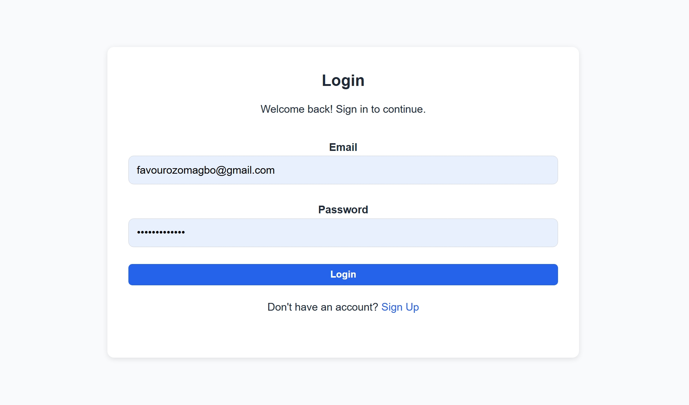
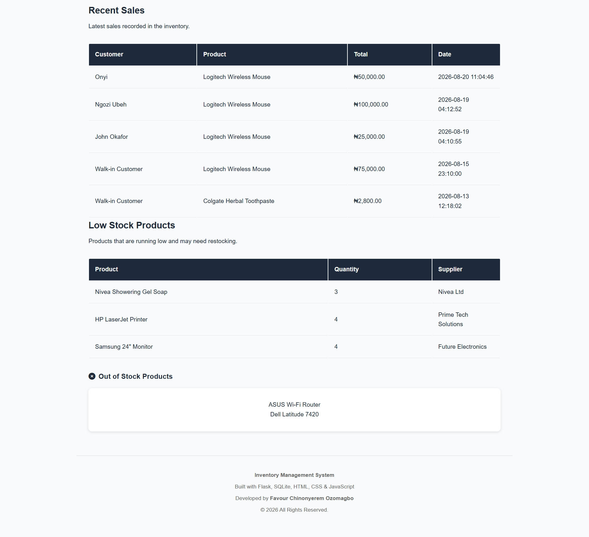
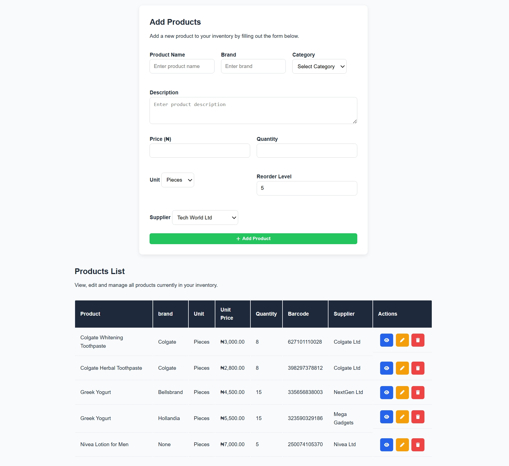
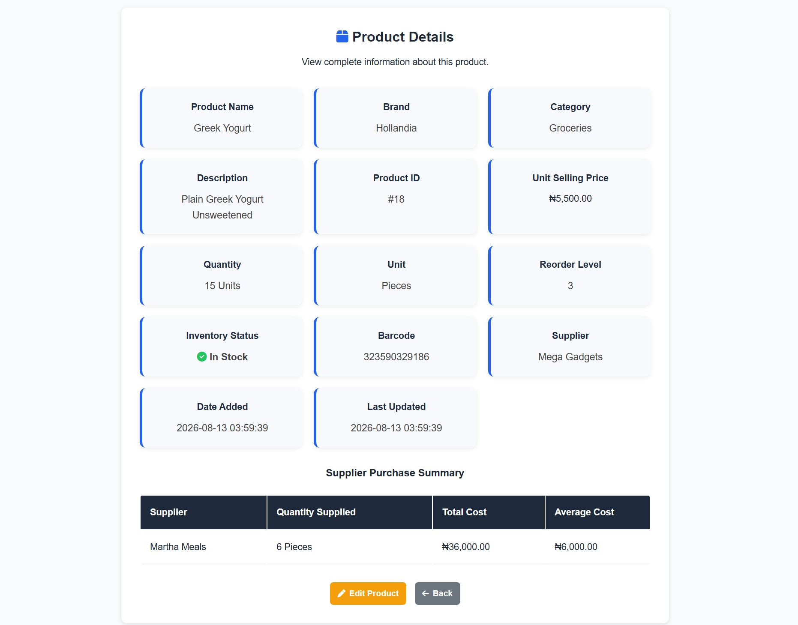
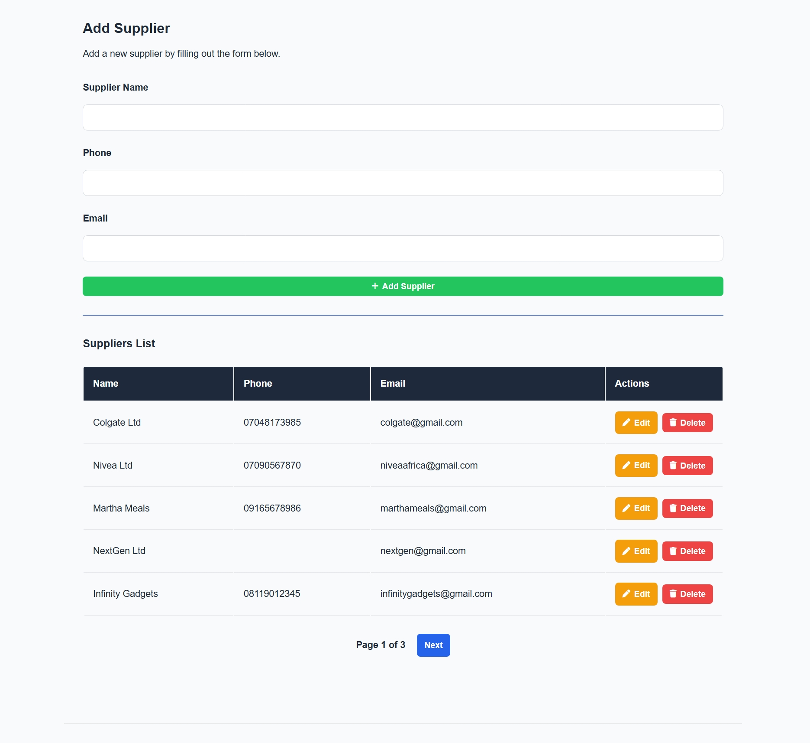
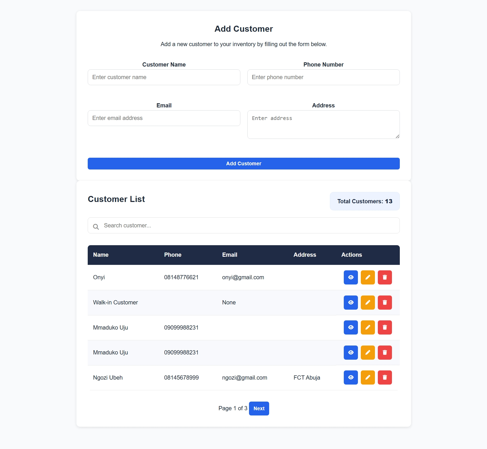
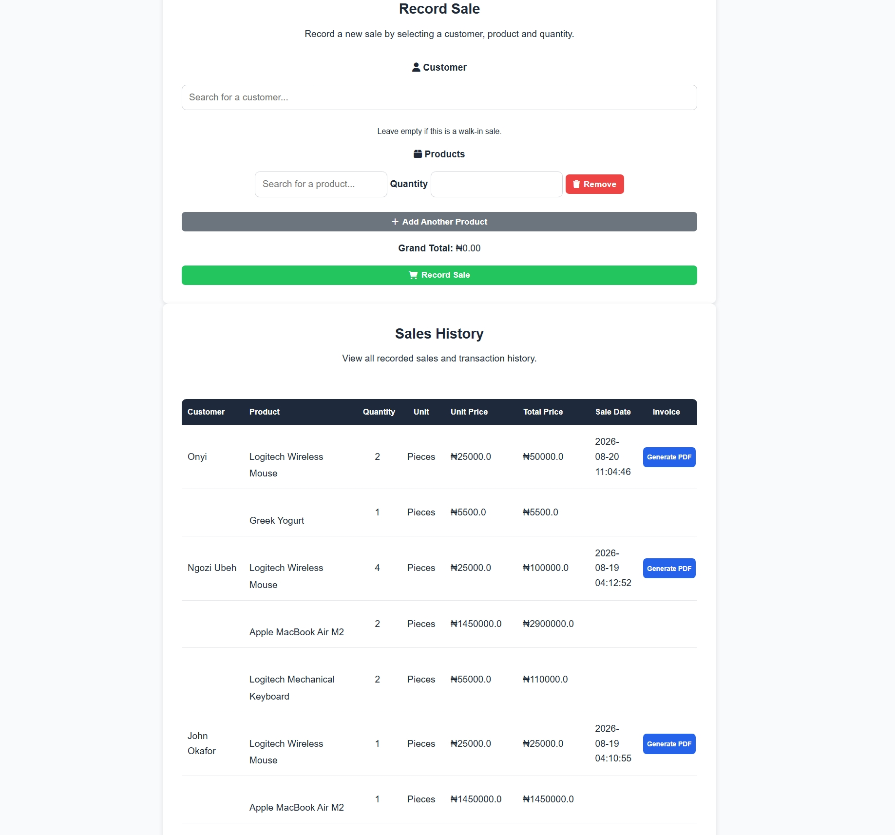
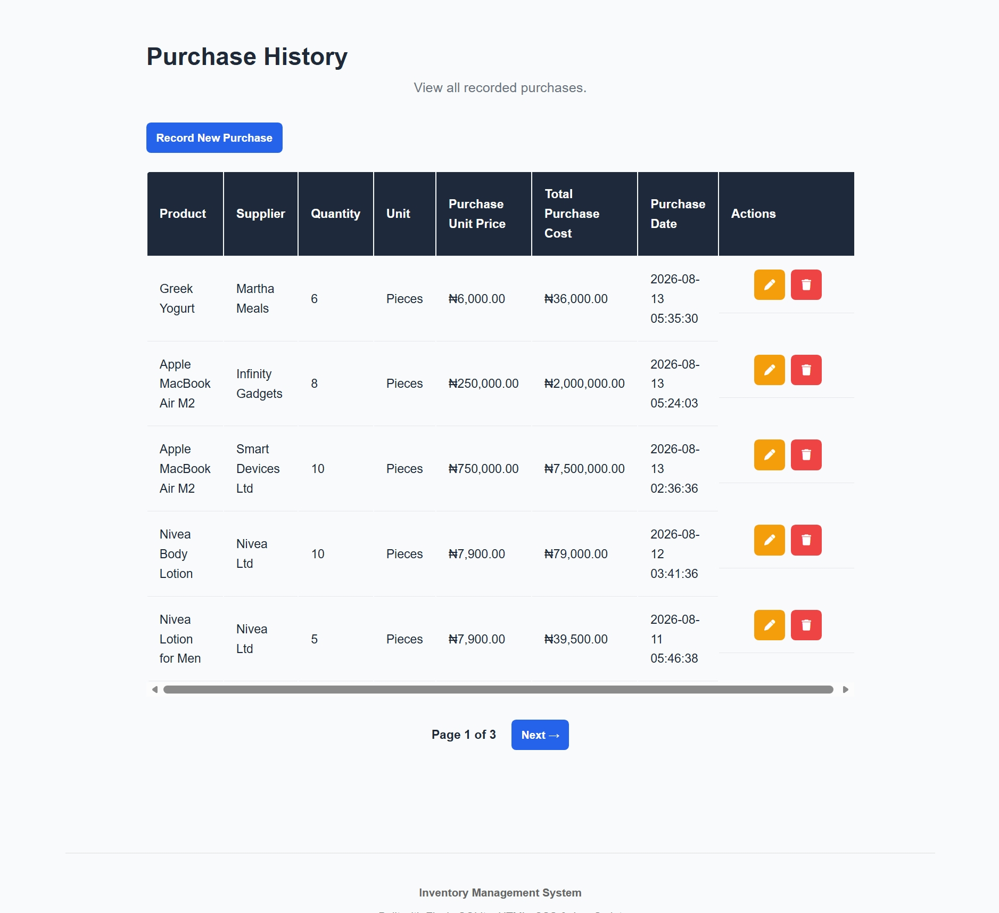
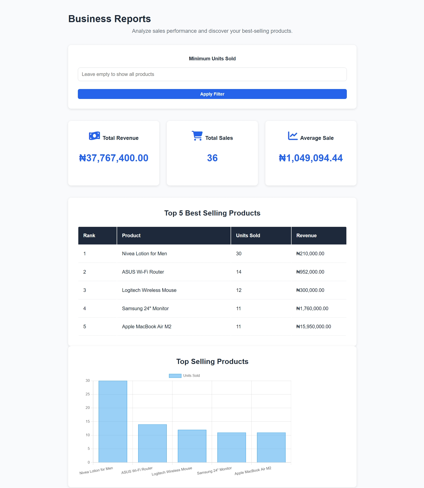
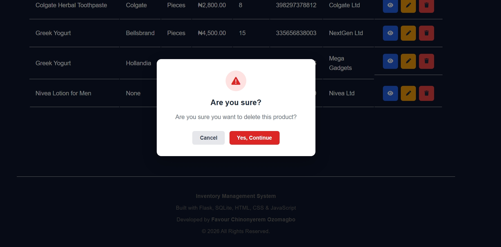

# 📦 Inventory Management System

A full-stack Inventory Management System built with Flask and SQLite to help businesses manage products, suppliers, customers, sales, purchases, stock levels, and inventory reports from one centralized dashboard.

The application includes authentication, CRUD operations, relational database management, stock tracking, pagination, search, purchase history, sales management, reports, and a responsive user interface with Light and Dark Mode.

---

## ✨ Features

### 🔐 Authentication

- User registration and login
- Session-based authentication
- Protected application routes
- Secure logout with confirmation
- Password handling

### 📦 Product Management

- Add new products
- Edit product information
- Delete products
- View detailed product information
- Track product quantity
- Track product unit
- Brand and category management
- Product descriptions
- Reorder levels
- Barcode information
- Product search
- Pagination

### 🚚 Supplier Management

- Add suppliers
- Edit supplier information
- Delete suppliers
- Supplier contact information
- View supplier-related products
- Search and pagination
- Supplier-product relationships

### 👥 Customer Management

- Add customers
- Edit customer information
- Delete customers
- View customer information
- Search and pagination

### 🛒 Sales Management

- Record sales
- Select products and customers
- Track quantities sold
- Calculate total sales cost
- Automatically update product stock
- View sales history
- Edit sales records
- Delete sales records with confirmation

### 🧾 Purchase Management

- Record new purchases
- Select products and suppliers
- Record purchase quantity
- Record purchase price
- Automatically increase product stock
- Connect products with suppliers
- View purchase history
- Edit purchase records
- Delete purchase records safely
- Purchase confirmation before deletion
- Pagination

### 📊 Inventory Dashboard

- Total products
- Stock information
- Sales information
- Purchase information
- Inventory statistics
- Visual charts and analytics

### 📈 Reports

- Inventory reports
- Sales information
- Purchase information
- Stock analysis
- Business performance data

### 🎨 User Interface

- Responsive layout
- Light Mode
- Dark Mode
- Font Awesome icons
- Hover effects and interactive navigation
- Confirmation modals for destructive actions
- Clean forms and tables
- Responsive navigation

---

## 🛠️ Technologies Used

### Frontend

- HTML5
- CSS3
- JavaScript
- Jinja2
- Font Awesome

### Backend

- Python
- Flask

### Database

- SQLite
- SQL
- sqlite3

### Development Tools

- Visual Studio Code
- Git
- GitHub

---

## 🗄️ Database Design

The application uses a relational SQLite database with multiple connected tables.

Main entities include:

- Users
- Products
- Suppliers
- Customers
- Sales
- Purchases
- Product-Suppliers

The system uses:

- Primary keys
- Foreign keys
- JOIN queries
- Many-to-many relationships
- Relational database design
- SQL CRUD operations

For example, products and suppliers can have a many-to-many relationship because a product can be supplied by multiple suppliers, while a supplier can provide multiple products.

---

## 🔄 Inventory Flow

### Purchases

When a purchase is recorded, the system:

1. Records the purchase in the database.
2. Connects the product and supplier.
3. Increases the product stock.
4. Displays the transaction in Purchase History.

### Sales

When a sale is recorded, the system:

1. Records the sale.
2. Records the products included in the sale.
3. Calculates the sale totals.
4. Reduces the product stock.
5. Displays the transaction in Sales History.
6. Allows an invoice PDF to be generated.

### Purchase Editing

When a purchase quantity is edited, the system calculates the difference between the old and new quantity and adjusts the product stock accordingly.

### Purchase Deletion

When a purchase is deleted, the system reverses the quantity that was originally added to inventory before removing the purchase record.

---

## 📸 Screenshots

### Login



### Dashboard



### Products



### Product Details



### Suppliers



### Customers



### Sales



### Purchase History



### Reports



### Dark Mode


### Delete Confirmation



---

## ⚙️ Installation & Setup

### 1. Clone the repository

```bash
git clone YOUR_GITHUB_REPOSITORY_URL

### 2.Navigate into the project directory
cd inventory-management-system

### 3.Create a virtual environment
python -m venv venv

### 4.Activate the virtual environment
venv\Scripts\activate

### 5.Install the required packages/dependencies
pip install -r requirements.txt

### 6.Run the application
python app.py

### 7.Open the application in your browser
http://127.0.0.1:5000/

---

## 📁 Project Structure

```text
inventory-management-system/
│
├── screenshots/
│
├── static/
│   ├── css/
│   │   └── style.css
│   │
│   └── js/
│       ├── charts.js
│       └── javascript.js
│
├── templates/
│   ├── about.html
│   ├── base.html
│   ├── customer_detail.html
│   ├── customers.html
│   ├── dashboard.html
│   ├── edit_customer.html
│   ├── edit_product.html
│   ├── edit_purchase.html
│   ├── edit_supplier.html
│   ├── index.html
│   ├── login.html
│   ├── low_stock.html
│   ├── product_details.html
│   ├── products.html
│   ├── purchase_history.html
│   ├── purchases.html
│   ├── reports.html
│   ├── sales.html
│   ├── signup.html
│   ├── supplier_details.html
│   └── suppliers.html
│
├── app.py
├── database.py
├── inventory.db
├── requirements.txt
└── README.md

---

## 🧠 What I Learned

Building this project helped me strengthen my understanding of full-stack web development and practical backend development.

### Backend Development
- Building web applications with Flask
- Creating Flask routes
- Handling GET and POST requests
- Working with forms and user input
- Using sessions for authentication
- Protecting application routes

### Database & SQL
- Designing relational databases with SQLite
- Creating and modifying database tables
- Using primary keys and foreign keys
- Performing CRUD operations
- Writing SQL queries
- Using JOINs to retrieve related data
- Working with many-to-many relationships
- Managing relationships between products and suppliers

### Frontend Development
- Building pages with HTML5
- Styling interfaces with CSS3
- Creating responsive layouts
- Using Jinja2 templates
- Adding interactive functionality with JavaScript
- Using Font Awesome icons
- Creating Light and Dark Mode

### Inventory Logic
- Managing product stock
- Increasing stock when purchases are recorded
- Decreasing stock when sales are recorded
- Adjusting stock when purchase records are edited
- Reversing stock changes when purchases are deleted
- Tracking low-stock and out-of-stock products

### Application Features
- Search functionality
- Pagination
- Confirmation modals
- Data validation
- Sales and purchase calculations
- PDF invoice generation
- Dashboard analytics and charts

### Development Workflow
- Organizing a Flask project using templates and static files
- Debugging application errors
- Testing application functionality
- Using Git and GitHub for version control

---

## 👩🏽‍💻 Author

**Favour Chinonyerem Ozomagbo**

Full-Stack Developer

Built with Python, Flask, SQLite, HTML, CSS, and JavaScript.

---

## 🔗 Connect With Me

- **GitHub:** [Favour Ozomagbo](https://github.com/favourozomagbo)
- **LinkedIn:** [Favour Ozomagbo](https://www.linkedin.com/in/favour-ozomagbo/)
- **Email:** favourozomagbo@gmail.com
- **Live Demo:** Coming soon

- This project is part of my growing full-stack development portfolio, where I build and deploy practical web applications while continuously expanding my skills across frontend, backend, databases, and deployment.